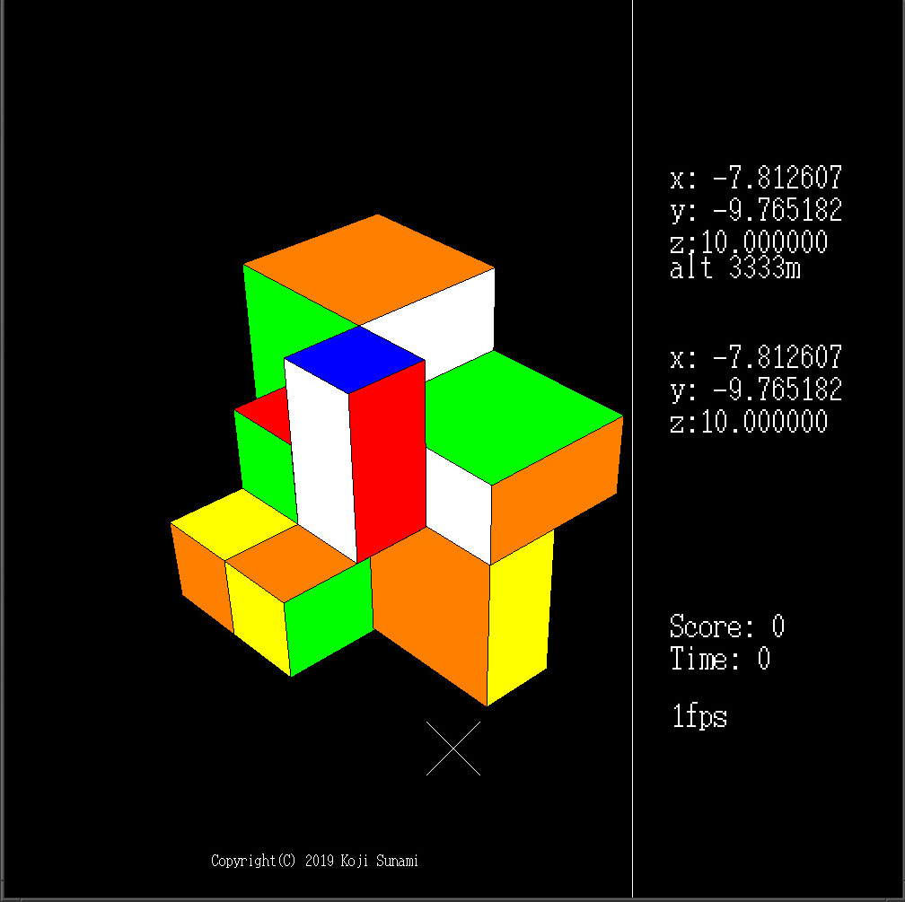

This program is a emulation of mirror cube, which is a similar product to Rubik's cube.
Mirror cube and Rubik's have exactly the same permutation except for the shape of each cube, and 
each solution is exactly the same. However, mirror cubes looks nicer ;)

Though there are defnitely systematic solutions, there is no algorithm that finds the least required
movement for the solution from an arbitrary initial position. Thus, I rather chose brute force attack. 
According to a research, it takes up to 14 movements are required to find a solution.
So, Up to 6^14 times of calculation are required.
Since the resource of computer is limited, I restrict the size of cube to 2x2x2.

In this program, I used OpenGL, and my machine is GNU/Linux.

In order to run the program, just type:

$ ./run

The key operations are as below. Type any combination of "a", "s", "d", and the cube will be permutated
immediately, and if we type "z", the computer will begin to calculate.

a	: rotate X
s	: rotate Y
d	: rotate Z
z	: find solution
x	: stop calculation

